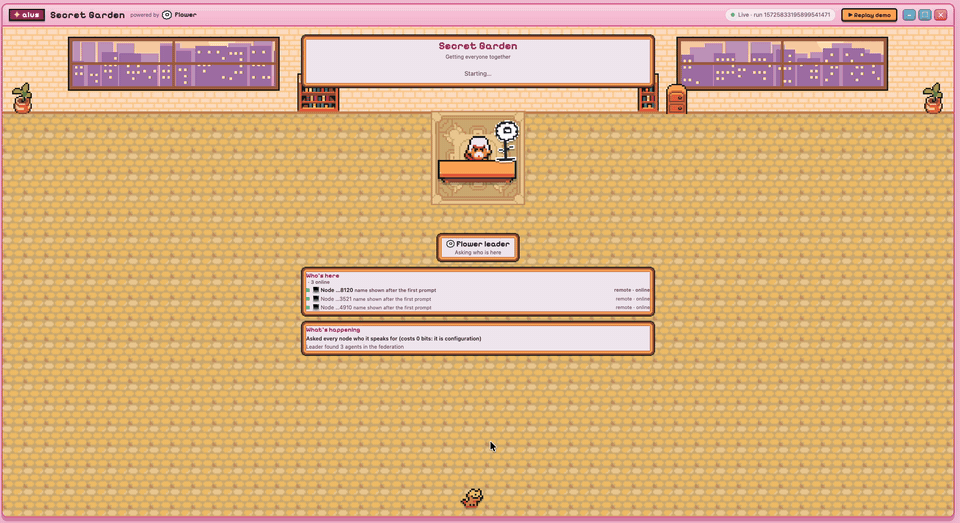
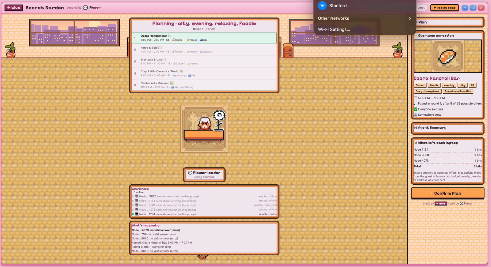

<div align="center">

# 🌸 Secret Garden

**Plan an event with your friends without anyone giving up their secrets.**

Everyone's AI agent keeps their calendar, budget, dietary and access needs on
their own laptop. A leader agent still finds a plan everyone can make, and at
the end it tells you exactly how much private information left each machine,
counted in bits.

Built on [Flower](https://flower.ai) · made by ✦ aius

[](docs/media/demo.mp4)

<sub>▶ Click for the full demo video (4½ min). The GIF is the last 30 seconds at 2× speed.</sub>

</div>

---

## What you're watching

The organiser types one sentence into `flwr chat`:

> *Plan a relaxing foodie evening in the city for Sam's birthday.*

Three friends have joined from **their own laptops**. Their profiles never
leave those machines. The leader turns the brief into tags
(`city · evening · relaxing · foodie`), lines up concrete offers, and asks each
agent one question per offer: *could you do this, yes or no?*

<p align="center">
  
</p>

| | |
| --- | --- |
| 🍣 **The plan** | Ozora Handroll Bar, 5:00–7:00 PM, downtown Palo Alto |
| 🔎 **How fast** | Found in round 1, after 5 of 55 possible offers |
| ✅ **Agreement** | Everyone said yes |
| 🔒 **What left each laptop** | **1 bit** each, **3 bits** in total |

Nobody stated a budget, a price range, their free hours, an allergy or a home
address. All of those decided the booking, and none of them crossed the
network.

## Why it works

Asking someone when they are free is asking for their calendar in a blurrier
form. Asking for their price range is asking for their budget. So Secret
Garden asks for neither.

Instead the leader proposes **fully specified offers** (this place, this hour,
this price) and collects a single yes or no for each one. A no reveals very
little: "I can't do 20:00" could mean a meeting, a commute, a babysitter or
just a preference, and the leader has no way to tell which.

Three things back that up in code rather than in a prompt:

- 🛡️ **A guard on every reply.** `guard.PolicyGrid` checks each outgoing
  message against a strict schema before a Flower message is ever built. Run
  `scripts/demo.sh --no-ui` to watch it refuse seven payloads that a helpful
  model might otherwise have sent.
- 🧮 **A disclosure ledger.** The leader counts the bits it receives from each
  person and prints the total at the end of every run.
- 🚧 **No side channels.** Flower only lets a SuperNode reply to the leader, so
  guests cannot talk to each other. Every bit goes through the leader, which is
  what makes the total measurable.

## Try it in 30 seconds

No federation, no model, no API key:

```bash
scripts/demo.sh
```

That runs the guard checks, then the whole protocol against simulated users,
then replays it in the console at <http://127.0.0.1:8765/>.

## Run it for real, across laptops

One person leads. Everyone else joins from their own machine, and their
private profile stays there.

**1. The leader** (only this laptop needs a key, from flower.ai → Settings → API Keys):

```bash
echo 'FLWR_MODEL_API_KEY=...' > backend/.env
scripts/run_leader.sh            # add --solo if all agents join from other laptops
```

This starts the SuperLink, the console and a node for each local profile, then
prints the exact join command with your network address.

**2. Each friend,** on their own laptop:

```bash
git clone https://github.com/uzmahm/aius-flower-hackathon && cd aius-flower-hackathon
cd backend && uv sync && cd ..
scripts/new_user.py sam                     # their profile, on their disk
scripts/join.sh sam --leader 10.35.4.9      # the address the leader sent them
```

They don't need an API key. With one, their agent uses the model; without
one, it decides by rules over their profile.

**3. The organiser,** in a second terminal on the leader's laptop:

```bash
cd backend && FLWR_CHAT_SUPERLINK=local-agent uv run flwr chat
/load .
Plan a relaxing foodie evening in the city for Sam's birthday. Keep it a surprise.
```

Remote friends show up in the console with a 💻 avatar and an empty private
panel. The leader has no copy of their calendar or budget, so there is nothing
to draw.

Want everything on one machine instead? `scripts/run_local.sh`. For the full
walkthrough, including what to do when a firewall gets in the way, see
[scripts/README.md](scripts/README.md).

## How it fits together

```
                  SuperLink: the LEADER
                  backend/event_planner/leader.py
                  runs the protocol, validates everything inbound,
                  keeps the disclosure ledger
                             |
        +----------+---------+---------+----------+
        |          |         |         |          |
    SuperNode  SuperNode SuperNode SuperNode  ... one per person
    participant.py + guard.PolicyGrid
    holds: calendar, budget, access needs, address (never sent)
```

| folder | what's in it |
| --- | --- |
| [backend/](backend/) | Everything that runs inside the Flower federation: protocol, policy, activity catalogue |
| [frontend/](frontend/) | The live Secret Garden console and the after-run report |
| [scripts/](scripts/) | Start, join, add users, run the checks |
| `backend/event_planner/users/*.json` | The people, one file each |

## Adding people

The leader hardcodes nobody. It asks whoever connected who they are (that
costs zero bits, since a node's name is configuration, not private data) and
plans for them.

```bash
scripts/new_user.py alex --likes nature,morning,active --avoid foodie \
    --budget 70 --curfew 22 --needs step_free --busy "09:00-10:00 gym"
scripts/join.sh alex        # joins a running federation; nothing restarts
```

Run `scripts/new_user.py` with no arguments for an interactive prompt.

## Activity types

The whole system speaks one small vocabulary, defined in
`backend/event_planner/policy.py`:

`nature` · `city` · `morning` · `evening` · `active` · `relaxing` · `foodie` · `shopping`

- **The organiser's brief** is parsed into these tags by `brief.py`. Synonyms
  count, so "brunch" reads as `morning` and "chill" as `relaxing`.
- **The guest of honour's wishes** are the only preferences anyone states out
  loud, because it's their event.
- **Every activity in the catalogue** (`activities.py`) carries these tags, and
  `morning`/`evening` also limit which time slots it can be offered in.

Everyone else's preferences stay private and only ever show up as yes or no
answers to concrete offers.

## Read more

- [backend/README.md](backend/README.md): the full design argument, measured
  numbers and honest limitations
- [frontend/README.md](frontend/README.md): how the console gets its data
- [scripts/README.md](scripts/README.md): every script, and troubleshooting
